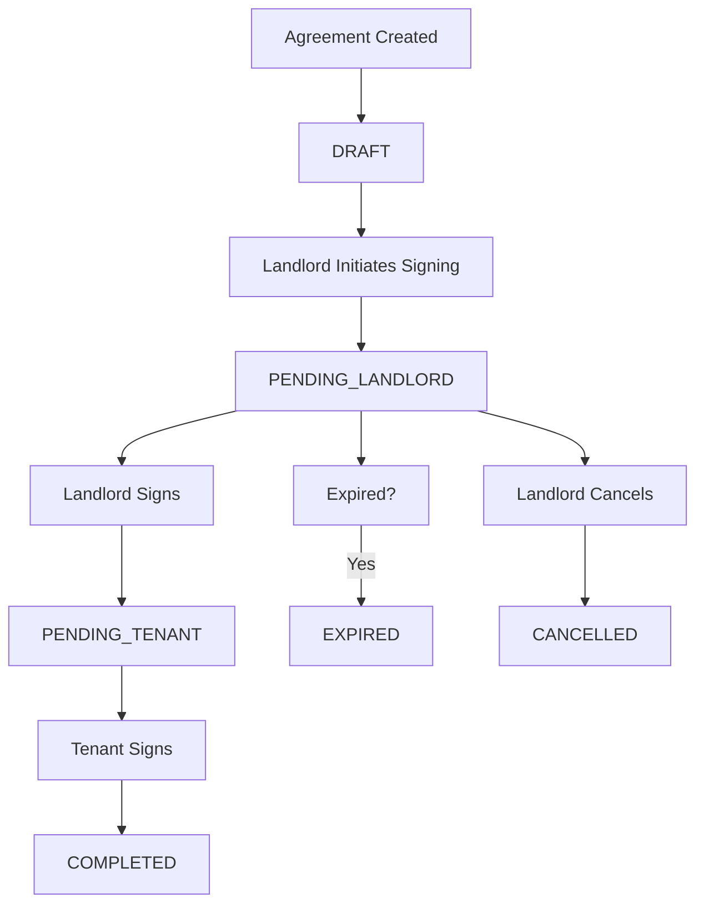

# Digital Agreement Module

## Overview

The Digital Agreement Module provides secure, legally binding electronic signature capabilities for rental agreements in the Rentverse application. This module ensures document integrity, tracks the signing workflow, and maintains a comprehensive audit trail.

## Security Features

| Feature | Implementation |
|---------|----------------|
| **Data Integrity** | SHA-256 hash of PDF document + signatures |
| **Workflow Validation** | Landlord must sign before tenant |
| **Access Control** | JWT-based, only parties can view/sign |
| **Audit Trail** | All actions logged with IP/timestamp |
| **Tamper Detection** | Hash comparison on verification |
| **Canvas Signatures** | Drawn signatures with confirmation checkbox |

---

## API Endpoints

### Base URL
```
https://rentverse-backend.onrender.com/api/agreements
```

### Endpoints

| Method | Endpoint | Description | Access |
|--------|----------|-------------|--------|
| `GET` | `/:id` | Get agreement details with access control | Private (Landlord/Tenant) |
| `POST` | `/:id/initiate` | Start the signing workflow | Private (Landlord only) |
| `POST` | `/:id/sign/landlord` | Landlord signs the agreement | Private (Landlord only) |
| `POST` | `/:id/sign/tenant` | Tenant signs the agreement | Private (Tenant only) |
| `GET` | `/:id/verify` | Public document verification | Public |
| `POST` | `/:id/cancel` | Cancel the agreement | Private (Landlord only) |
| `GET` | `/:id/audit` | Get audit trail for agreement | Private (Landlord/Tenant) |
| `GET` | `/lease/:leaseId` | Get agreement by lease ID | Private (Landlord/Tenant) |

---

## Database Schema

### Enhanced RentalAgreement Model

```prisma
model RentalAgreement {
  id              String    @id @default(uuid())
  leaseId         String    @unique
  pdfUrl          String?
  status          AgreementStatus @default(DRAFT)
  documentHash    String?   // SHA-256 hash of PDF
  
  // Landlord signature
  landlordSigned    Boolean   @default(false)
  landlordSignature String?   @db.Text
  landlordSignedAt  DateTime?
  landlordSignHash  String?   // SHA-256 hash
  landlordIpAddress String?
  landlordConfirmed Boolean   @default(false)
  
  // Tenant signature
  tenantSigned      Boolean   @default(false)
  tenantSignature   String?   @db.Text
  tenantSignedAt    DateTime?
  tenantSignHash    String?   // SHA-256 hash
  tenantIpAddress   String?
  tenantConfirmed   Boolean   @default(false)
  
  // Workflow
  expiresAt     DateTime?
  completedAt   DateTime?
  cancelledAt   DateTime?
  cancelReason  String?
  
  // Versioning
  currentVersion Int @default(1)
  
  // Relations
  lease         Lease @relation(fields: [leaseId], references: [id])
  auditLogs     AgreementAuditLog[]
  versions      AgreementVersion[]
}
```

### AgreementStatus Enum

```prisma
enum AgreementStatus {
  DRAFT
  PENDING_LANDLORD
  PENDING_TENANT
  COMPLETED
  EXPIRED
  CANCELLED
}
```

### AuditAction Enum

```prisma
enum AuditAction {
  CREATED
  VIEWED
  SIGNATURE_REQUESTED
  LANDLORD_SIGNED
  TENANT_SIGNED
  COMPLETED
  EXPIRED
  CANCELLED
  DOWNLOADED
  VERIFICATION_SUCCESS
  VERIFICATION_FAILED
  VERSION_CREATED
}
```

---

## Backend Services

### `digitalAgreement.service.js`

Core service with the following methods:

| Method | Description |
|--------|-------------|
| `createSignatureHash()` | SHA-256 hash of signature data |
| `createDocumentHash()` | PDF integrity hash |
| `verifySignatureHash()` | Validate signature integrity |
| `initiateSigningWorkflow()` | Start signing process |
| `signAsLandlord()` | Landlord signs with validation |
| `signAsTenant()` | Tenant signs (requires landlord first) |
| `verifyDocumentIntegrity()` | Tamper detection |
| `getAgreementWithAccess()` | Access control |
| `cancelAgreement()` | Landlord can cancel |
| `createVersion()` | Document versioning |
| `getAuditTrail()` | Audit log retrieval |

---

## Frontend Components

### SignaturePad.tsx

Canvas-based signature component with:
- Touch and mouse support
- Clear/redo functionality
- Base64 export for storage

### AgreementSigningPage.tsx

Located at: `app/agreements/[id]/page.tsx`

Features:
- Agreement details display
- Party signing status
- Signature pad integration
- Confirmation checkbox (legally binding)
- Success/error states
- Expiry warnings

---

## Signing Workflow



---

## Security Implementation Details

### Signature Hashing

```javascript
createSignatureHash(signature, timestamp, leaseId, userId) {
  const data = `${signature}|${timestamp}|${leaseId}|${userId}`;
  return crypto.createHash('sha256').update(data).digest('hex');
}
```

### Access Control

Every endpoint validates:
1. JWT token authentication
2. User is either landlord or tenant of the agreement
3. Current signing status allows the requested action

### Audit Logging

All actions are logged with:
- User ID
- Action type
- IP address
- Timestamp
- Additional metadata

---

## Files Created/Modified

### Backend
- `rentverse-backend/src/services/digitalAgreement.service.js` (NEW)
- `rentverse-backend/src/routes/agreement.routes.js` (NEW)
- `rentverse-backend/src/app.js` (MODIFIED - added routes)
- `rentverse-backend/prisma/schema.prisma` (MODIFIED - added models/enums)

### Frontend
- `rentverse-frontend/components/SignaturePad.tsx` (NEW)
- `rentverse-frontend/app/agreements/[id]/page.tsx` (NEW)

---

## Environment Variables

No new environment variables required. Uses existing:
- `DATABASE_URL` - PostgreSQL connection
- `JWT_SECRET` - Token verification

---

## Deployment Status

✅ **Deployed successfully** on 2025-12-14

Backend: https://rentverse-backend.onrender.com

---

## Testing

To test the signing workflow:

1. Create a lease/booking in the app
2. Generate the agreement PDF
3. Navigate to `/agreements/[id]`
4. Sign as landlord first
5. Sign as tenant
6. Verify completion status
